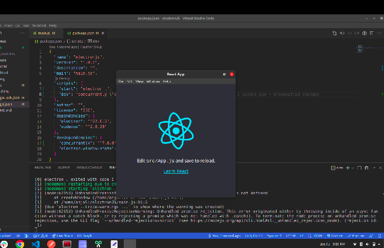

# elctron-js

how to run
-npm run watch 

devlopment integration
-npm run dev

requirements 
-npm install electron --save-dev 
-npm install --save-dev electron-window-stat
-npm i nodemon
-npm i electron-builder

